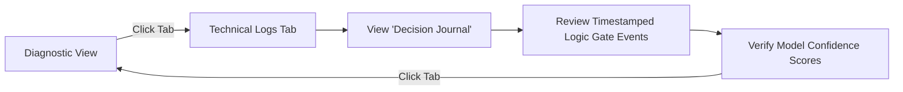
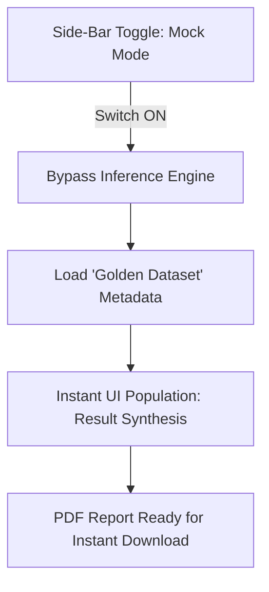

stepsCompleted: [1, 2, 3, 4, 5, 6, 7, 8, 9, 10, 11, 12, 13, 14]
inputDocuments: ["prd.md", "product-brief-NeuroGemma.md", "project-context.md"]
project_name: 'NeuroGemma'
user_name: 'Pedro'
date: '2026-05-11'
---

# UX Design Specification NeuroGemma

**Author:** Pedro
**Date:** 2026-05-11

---

## Executive Summary

### Project Vision

NeuroGemma is designed to bridge the "deployment gap" in medical AI by transforming raw, fragmented model outputs into a cohesive, "Relieved" clinical experience. The project vision centers on an intelligent orchestration layer (the Axial-Flair Logic Gate) that minimizes clinician cognitive load by presenting multi-model insights within a professional-grade, minimalist diagnostic interface.

### Target Users

*   **Clinical Radiologists:** Experts seeking a streamlined workflow that synthesizes Anatomical Plane, Sequence, Depth, and Natural Language narratives into a single-view dashboard and one-click PDF report.
*   **Academic Evaluators:** Technical stakeholders requiring transparent evidence of the orchestration logic and pipeline stability during the thesis defense.
*   **The Student Developer:** Needs a robust, demo-ready platform capable of local high-performance inference and failsafe "Mock Mode" operation.

### Key Design Challenges

*   **Multi-Source Synthesis:** Integrating quantitative CNN labels and qualitative VLM narratives into a single, legible hierarchy.
*   **Feedback & Latency:** Managing user expectations during significant inference periods (30-60s) with clear, progress-oriented UI feedback.
*   **Dual-Nature Interface:** Maintaining a minimalist clinical "Diagnostic View" while providing a secondary "Technical Logs" view for engineering validation.

### Design Opportunities

*   **The "Relieved" Aesthetic:** Using a specialized "Medical Blue" palette and generous whitespace to reduce "inference fatigue" and clinician burnout.
*   **Intelligent Transitions:** Visually highlighting the "Logic Gate" decision points to demonstrate the system's underlying intelligence and compute efficiency.
*   **One-Click Fidelity:** Providing instant transition from on-screen diagnosis to a professional PDF "Radiology Note," reinforcing the tool's clinical utility.

## Core User Experience

### Defining Experience

The core NeuroGemma experience is the **Unified Diagnostic Synthesis**. The user uploads a single brain scan and receives a consolidated view of four AI models' findings. The interaction is designed to feel cohesive rather than fragmented, moving from raw image to a structured "Relieved" diagnosis in a single, linear flow.

### Platform Strategy

*   **Platform:** Monolithic Streamlit Web Application.
*   **Context:** High-performance local GPU server environment.
*   **Interaction Model:** Desktop-first (workstation) using mouse and keyboard for precise diagnostic review and one-click report generation.

### Effortless Interactions

*   **Subtle Intelligence:** The MedGemma VLM narrative integrates naturally into the dashboard without intrusive signaling, appearing only when the Logic Gate confirms relevance.
*   **Automated Documentation:** One-click PDF generation with intelligent auto-naming (Original_File + Plane + Timestamp).
*   **Instant Demo Stability:** A persistent "Mock Mode" sidebar toggle that instantly populates the interface with "Golden Dataset" values for flawless presentations.

### Critical Success Moments

*   **The "Relieved" Reveal:** The moment the inference completes and the clinician sees the quantitative labels and qualitative narrative side-by-side in a clean, Medical Blue layout.
*   **The One-Click Note:** The successful generation of a professional PDF "Radiology Note" that perfectly mirrors the on-screen findings.

### Experience Principles

*   **Subtle Transparency:** Provide progress feedback through low-saturation "Pipeline Breadcrumbs" to manage latency without creating anxiety.
*   **Clinical Calm:** Use the "Medical Blue" palette and generous whitespace to actively reduce cognitive load and "inference fatigue."
*   **Frictionless Fidelity:** Ensure the transition from raw image upload to a final, downloadable report requires the absolute minimum number of user clicks.

## Desired Emotional Response

### Primary Emotional Goals

*   **Clinical Relief:** The user should feel that the system has successfully synthesized complex, fragmented data into a cohesive diagnostic insight, reducing mental effort and "inference fatigue."
*   **Trust & Confidence:** A sense of reliability in the system's "Axial-Flair Logic Gate" orchestration—knowing the qualitative narrative is triggered only when clinically relevant.
*   **Professionalism:** The application should feel like a peer-reviewed clinical workstation tool, prioritizing clarity, accuracy, and professional restraint.

### Emotional Journey Mapping

*   **Initial Discovery:** Calm curiosity; the "Medical Blue" palette establishes a quiet, focused clinical workspace.
*   **Inference Latency (60s):** Patient anticipation; "Pipeline Breadcrumbs" provide continuous, low-saturation feedback that builds trust in the process.
*   **The Reveal:** Clarity and satisfaction; the unified display of labels and narrative provides an immediate "Aha!" moment of diagnostic synthesis.
*   **Documentation/Exit:** Accomplishment; generating the professional PDF report provides a tangible sense of task completion and clinical readiness.

### Micro-Emotions

*   **Confidence vs. Anxiety:** Countering long inference times with transparent progress tracking.
*   **Transparency vs. Skepticism:** Using the "Technical Logs" as a "Decision Journal" to demystify the AI's internal logic.
*   **Stability vs. Fragility:** Using the "Mock Mode" to project engineering robustness and reliability during high-stakes demonstrations.

### Design Implications

*   **Relieved Aesthetic →** Generous whitespace, minimalist "Medical Blue" color palette, and a octet "Two-Tab" layout to prevent information overwhelm.
*   **Subtle Intelligence →** Natural integration of the VLM narrative into the UI, avoiding intrusive signaling while the "Logic Gate" works behind the scenes.
*   **Transparent Auditing →** Transforming raw technical data into a human-readable "Decision Journal" within the Technical Logs tab.

### Emotional Design Principles

*   **Quiet Feedback:** Inform the user without interrupting them; use low-saturation UI elements for progress and status.
*   **Defensive Engineering as UX:** Use "Mock Mode" and "Golden Datasets" not just as failsafes, but as a way to project an image of unshakeable professional stability.
*   **The "Human-in-the-Loop" Safety Net:** Ensure all emotional design leads back to the clinician's final authority, supported by mandatory clinical disclaimers.

## UX Pattern Analysis & Inspiration

### Inspiring Products Analysis

*   **Bear (Minimalist Focus):** Inspires the "Relieved" aesthetic through clean typography, generous whitespace, and a distraction-free "Clean Canvas" layout.
*   **Modern AI Dashboards:** Inform the structured display of qualitative text (narrative) and real-time inference status.
*   **Professional PACS Viewers:** Provide the mental model for high-contrast image viewing and centralized diagnostic labels.

### Transferable UX Patterns

*   **The "Clean Canvas" Pattern:** Prioritizing the brain scan and the unified diagnostic results as the primary visual focus, with technical tools tucked into a secondary tab or sidebar.
*   **Typography-First Narrative:** Using professional, high-legibility fonts for the MedGemma VLM output to make the "Radiology Note" draft feel like a polished clinical document.
*   **The Floating Action Button (FAB) Export:** A single, persistent "Generate Report" button that provides a clear "Success Path" after inference is complete.

### Anti-Patterns to Avoid

*   **Dashboard Overload:** Avoiding unnecessary gauges, charts, or "tech-heavy" metrics that contribute to "inference fatigue."
*   **The "Black Box" Spinner:** Moving away from generic "Processing..." screens in favor of transparent, low-saturation pipeline breadcrumbs.
*   **Cluttered Toolbars:** Keeping clinical metadata separated from the core diagnostic view to maintain the "Relieved" focus.

### Design Inspiration Strategy

*   **Adopt:** The minimalist typography and whitespace of focus apps like Bear to create a "Relieved" clinical environment.
*   **Adapt:** "Pipeline Breadcrumbs" to manage the 60-second inference latency without breaking the user's focus or creating anxiety.
*   **Avoid:** Traditional "Medical Software Clutter" (overly complex menus and dense data grids) that complicates the diagnostic workflow.

## Design System Foundation

### 1.1 Design System Choice

**Native Streamlit + Custom CSS (The Themeable Hybrid)**

### Rationale for Selection

*   **Framework Alignment:** Native Streamlit components ensure maximum stability and rapid implementation within the project's monolithic Python architecture.
*   **Aesthetic Flexibility:** Custom CSS allows for surgical precision in overriding Streamlit's defaults to achieve the "Medical Blue" palette and "Relieved" whitespace inspired by minimalist focus apps like Bear.
*   **Performance:** Minimizes external JS overhead, ensuring the local GPU-bound application remains responsive and predictable.

### Implementation Approach

*   **Global Theming:** Utilization of Streamlit's `config.toml` to establish the primary clinical color palette, background tones, and typography.
*   **Scoped Styling:** Using `st.markdown` with embedded `<style>` tags to manage custom container padding, border-radii for diagnostic result blocks, and "Pipeline Breadcrumb" visualization.
*   **Modular Components:** Leveraging Streamlit's layout primitives (`st.tabs`, `st.columns`, `st.container`) to create the strict "Two-Tab" diagnostic experience.

### Customization Strategy

*   **The "Relieved" Override:** Increasing default margins and padding via CSS to ensure the UI feels spacious and calm.
*   **Typography Hierarchy:** Establishing a clear contrast between quantitative CNN labels and the qualitative MedGemma VLM narrative using professional-grade clinical fonts.
*   **Diagnostic Highlighting:** Using "Medical Blue" accents specifically for successful classification results and the final PDF generation trigger.

## 2. Core User Experience

### 2.1 Defining Experience

The defining experience of NeuroGemma is **"The Intelligent One-Click Pipeline."** The user’s only required action is a single image upload; the system then autonomously orchestrates a multi-model sequence (3 CNNs + 1 VLM), intelligently triggering the narrative only when clinically relevant. It is the experience of total orchestration where the technical complexity is hidden behind a single point of entry.

### 2.2 User Mental Model

Users interact with NeuroGemma as an **"Intelligent Reporting Assistant."** They bring the mental model of a collaborative assistant that performs the tedious "pre-work"—classification, depth regression, and initial narrative drafting—leaving the clinician to act as the final authority and validator of the synthesized findings.

### 2.3 Success Criteria

*   **The Seamless Reveal:** Success is achieved when the inference pipeline completes and all results (Plane, Sequence, Depth, and Narrative) appear simultaneously in a unified layout without requiring additional user clicks or manual model triggers.
*   **Orchestration Trust:** The user feels successful when they observe the "Logic Gate" accurately identifying scan types and providing the appropriate level of detail (Narrative vs. Labels only) for each specific image.
*   **Zero-Friction Documentation:** The transition from the "Seamless Reveal" to a downloadable PDF "Radiology Note" happens in a single, predictable step.

### 2.4 Novel UX Patterns

NeuroGemma combines established patterns with a novel **"Conditional Narrative Flow."** While quantitative labels (CNNs) are familiar, the conditional triggering of a qualitative MedGemma narrative based on those labels is a unique architectural pattern. We will use **"Subtle Integration"** to ensure this feels like an intelligent expansion of the UI rather than a disruptive pop-up.

### 2.5 Experience Mechanics

**1. Initiation:**
*   **Trigger:** A single, prominent file uploader in the "Relieved" clinical workspace.
*   **Action:** User drags or selects a brain scan image (JPG/PNG).

**2. Interaction:**
*   **Automated Pipeline:** The system immediately begins the "Axial-Flair Logic Gate" sequence.
*   **Progress Tracking:** Low-saturation "Pipeline Breadcrumbs" light up sequentially (ID → Logic Gate → Synthesis) to manage the 60s latency.

**3. Feedback:**
*   **The Seamless Reveal:** The layout expands to show all model outputs in a structured hierarchy, with "Medical Blue" accents highlighting key findings.
*   **Technical Validation:** A "Decision Journal" in the secondary tab provides an audit trail for the orchestration steps.

**4. Completion:**
*   **The Final Note:** A single "Generate Report" button becomes active, allowing the user to download the synthesized PDF "Radiology Note."

## Visual Design Foundation

### Color System

*   **Primary (Clinical Teal):** `#007BFF` or `#20B2AA` (Light Sea Green) - used for primary CTAs like "Generate Report" and "Upload."
*   **Secondary (Soft Navy):** `#2C3E50` - used for clear, professional headings.
*   **Background (Calm Slate):** `#F8F9FA` - a very light, soft gray to reduce eye strain and provide a "Relieved" workspace.
*   **Success Indicator:** `#28A745` - used for the "Plane & Sequence" classification labels to signal high-confidence completion.
*   **Semantic Accents:** "Medical Blue" tones used for pipeline progress indicators and container borders.

### Typography System

*   **Style:** Modern/Clean.
*   **Primary Font:** **Inter** or **Open Sans** (Sans-Serif).
*   **Hierarchy:**
    *   **Headings:** Soft Navy, bold, 1.25rem - for diagnostic sections.
    *   **Body (Narrative):** Calm Slate text on white containers, 1rem, 1.6 line-height - optimized for high readability of the MedGemma VLM report draft.
    *   **Labels:** Monospace or Bold Sans-Serif - for quantitative CNN results (Plane, Sequence, Depth).

### Spacing & Layout Foundation

*   **Layout Structure:** **Wide/Fluid.** Designed for side-by-side diagnostic comparison. The left panel houses the "X-ray/Brain Scan Viewer," while the right panel displays the synthesized model findings and MedGemma narrative.
*   **Spacing Strategy:** **"Efficient Density within Airy Spacing."** Component-level text (labels/notes) is compact for clinical efficiency, but containers are surrounded by generous 2rem margins and clear dividers to prevent information overwhelm.
*   **Grid System:** Two-column split layout for the primary Diagnostic View; centralized monolithic column for the secondary Technical Logs view.

### Accessibility Considerations

*   **Contrast Ratio:** Ensuring all "Medical Blue" text on light gray backgrounds meets WCAG AA standards for legibility.
*   **Readability:** Generous line-spacing (1.6) for the qualitative narrative to prevent "text blocks" from becoming fatiguing.
*   **Visual Fatigue:** High-contrast containers for the medical images (dark mode for the scan viewer itself) within the lighter "Relieved" app theme.

## Design Direction Decision

### Design Directions Explored

We explored four distinct visual paths:
*   **Split Screen:** Prioritizing side-by-side image-to-text comparison.
*   **Modern Canvas:** An airy, narrative-focused layout.
*   **Assistant's Notebook:** A typography-centric, document-style view.
*   **Technical Precision:** A high-density view showcasing model confidence and logic gate statuses.

### Chosen Direction

**The Technical-Clinical Hybrid (Direction 1 + Direction 4)**

### Design Rationale

*   **Workflow Efficiency:** The Wide/Fluid split-screen foundation (Direction 1) directly supports the radiologist's mental model of verifying AI narrative text against raw pixel data in a single horizontal gaze.
*   **Academic Transparency:** Integrating the structured technical labels and confidence scores (Direction 4) provides the "Decision Journal" evidence required for the thesis defense, building trust in the underlying orchestration.
*   **Modern Authority:** Maintaining clean, high-legibility Sans-Serif typography (Inter) ensures the platform feels like a cutting-edge clinical dashboard rather than a legacy hospital system.

### Implementation Approach

*   **Layout:** Two primary panes. The left pane remains dedicated to the black-background "Brain Scan Viewer." The right pane contains the synthesized results.
*   **Technical Sidebar/Top-Bar:** Small, high-density cards within the right pane display quantitative CNN outputs (Plane, Sequence, Depth) alongside their confidence scores (e.g., "[0.99]").
*   **Integrated Narrative:** The MedGemma VLM narrative occupies the primary vertical space in the right pane, styled as a professional clinical note.
*   **The Logic Gate Signal:** A clear, success-colored status indicator showing the "VLM Triggered" event to visually confirm the orchestration's intelligence.

## User Journey Flows

### 3.1 The Diagnostic Synthesis (The "Relieved" Path)

This is the primary clinical workflow where the user transforms a raw scan into a synthesized diagnostic draft.

```mermaid
graph TD
    A[Start: Upload Placeholder (Left)] -->|Drag & Drop Image| B[Image Displayed in Viewer]
    B --> C[Pipeline Breadcrumbs Activate (Right-Top)]
    C --> D{Logic Gate: Axial-FLAIR?}
    D -- Yes --> E[Trigger MedGemma VLM]
    D -- No --> F[Skip VLM Narrative]
    E --> G[Reveal: CNN Labels + VLM Narrative]
    F --> H[Reveal: CNN Labels + 'Qualitative Skip' Message]
    G --> I[Success: Floating PDF Export Active]
    H --> I
```

### 3.2 The Orchestration Audit (The Evaluator Path)

The path for thesis committee members to verify the engineering integrity of the multi-model pipeline.



### 3.3 The Defensive Failover (The "Mock Mode" Path)

The critical fail-safe for ensuring a flawless demonstration regardless of server or network status.



### Journey Patterns

*   **Left-to-Right Progression:** Navigation follows a standard Western reading pattern, moving from raw input (left image) to synthesized output (right data).
*   **The Progress Beacon:** Using "Pipeline Breadcrumbs" as a persistent visual anchor during the 60-second latency period.
*   **Zero-State Clarity:** Pre-allocated space on the right panel uses informative "Zero-State" messages (e.g., "Analysis Skipped") to maintain trust when specific models are bypassed.

### Flow Optimization Principles

*   **Minimizing "Jumps":** Using pre-allocated containers to ensure the UI remains stable and "Relieved" as model results populate at different times.
*   **Contextual Transparency:** Transforming raw logs into a "Decision Journal" to make technical auditing a human-readable experience.
*   **Instant Gratification (Mock Mode):** Ensuring the fail-over path is instantaneous, projecting professional engineering stability.

## Component Strategy

### Design System Components

The core of NeuroGemma's UI will leverage Streamlit's native components for foundational elements and rapid development. These include:

*   **Input & Interaction:** `st.button` for general actions, `st.checkbox` or a custom switch for the Mock Mode toggle, and `st.file_uploader` as the base for image uploads.
*   **Layout & Structure:** `st.container`, `st.columns`, and `st.tabs` will be used extensively to build the primary "Diagnostic View" and "Technical Logs" sections, ensuring a clear information hierarchy. `st.sidebar` will manage global controls like the Mock Mode toggle.
*   **Media & Data Display:** `st.image` will handle the brain scan visualization, while `st.markdown`, `st.dataframe`, and `st.metric` will be instrumental in presenting the VLM narrative, CNN labels, and technical log details.
*   **Feedback & Status:** `st.status` and `st.progress` will provide general user feedback during inference, though custom styling will enhance their visual representation.

### Custom Components

Several key UI elements require custom implementation to achieve the "Relieved" aesthetic, functional precision, and specific feedback mechanisms outlined in the UX design.

#### 1. Image Upload Area (Enhanced Drag & Drop)
**Purpose:** To provide an intuitive and visually engaging entry point for uploading brain scan images. It needs to convey a sense of calm and professionalism.
**Usage:** The primary interaction point on the "Diagnostic View" for initiating the inference pipeline.
**Anatomy:** A distinct container with a clear call-to-action, drag-and-drop target, and visual feedback for file selection/upload.
**States:** Default (awaiting file), Hover (drag-over feedback), Loading (uploading animation), Success (file loaded), Error (unsupported file type).
**Variants:** Single instance on the main diagnostic view.
**Accessibility:** Clear instructions, ARIA attributes for drag-and-drop interaction, keyboard navigation support.
**Content Guidelines:** Short, concise instruction text (e.g., "Drag & Drop Brain Scan Here or Click to Upload").
**Interaction Behavior:** Visually responds to drag events; initiates file upload on drop or click.

#### 2. Pipeline Progress Indicator (Sequential "Breadcrumbs")
**Purpose:** To transparently communicate the multi-stage inference pipeline's progress, managing user expectations during latency.
**Usage:** Displayed prominently during the inference process, guiding the user through the "Axial-Flair Logic Gate" steps.
**Anatomy:** A horizontal sequence of distinct, low-saturation visual elements (e.g., circles or tabs) each representing a stage (e.g., ID, Logic Gate, Synthesis), with an active state highlight.
**States:** Inactive, Active (current step), Completed (past step), Error (failed step).
**Variants:** Fixed placement, responsive to container width.
**Accessibility:** Provides text alternatives for visual progress, ARIA live regions for screen readers to announce stage changes.
**Content Guidelines:** Concise stage names (e.g., "Image ID," "Logic Gate," "Synthesis," "Report Ready").
**Interaction Behavior:** Updates dynamically as the backend pipeline progresses; non-interactive for the user.

#### 3. CNN Label Cards/Tags
**Purpose:** To clearly and concisely present the quantitative classifications (Plane, Sequence, Depth) and their confidence scores.
**Usage:** Organized within the Diagnostic Results Display to provide an at-a-glance summary of CNN findings.
**Anatomy:** Small, visually distinct cards or tags, each containing a label (e.g., "Axial") and a confidence score (e.g., "[0.99]"), possibly with a subtle color-coding for high confidence.
**States:** Default (displaying value), potentially an 'uncertain' state for lower confidence.
**Variants:** Three distinct cards/tags for Plane, Sequence, and Depth.
**Accessibility:** Labels are programmatically associated with their values; color contrast meets WCAG AA.
**Content Guidelines:** Short, clear labels and numerical confidence scores.
**Interaction Behavior:** Static display; potentially hover for more detail (though this would add complexity).

#### 4. Logic Gate Trigger Indicator
**Purpose:** To provide immediate and clear visual confirmation when the "Axial-Flair Logic Gate" successfully triggers the MedGemma VLM.
**Usage:** Appears adjacent to or within the VLM Narrative display when the VLM output is presented.
**Anatomy:** A distinct, success-colored icon (e.g., a checkmark or lightbulb) accompanied by concise text (e.g., "VLM Triggered").
**States:** Inactive (VLM bypassed), Active (VLM triggered).
**Variants:** Single visual indicator.
**Accessibility:** Textual description for screen readers.
**Content Guidelines:** "VLM Triggered" or similar clear phrase.
**Interaction Behavior:** Appears dynamically upon successful VLM inference.

#### 5. Generate Report Floating Action Button (FAB)
**Purpose:** To provide a highly accessible and persistent action for generating the PDF "Radiology Note" after inference.
**Usage:** Floats at a fixed position (e.g., bottom-right) of the Diagnostic View, always visible.
**Anatomy:** A circular or rounded button with an icon (e.g., download, PDF) and concise text ("Generate Report").
**States:** Disabled (during inference), Enabled (post-inference), Hover, Pressed.
**Variants:** Only one primary FAB.
**Accessibility:** High contrast, large enough hit area, ARIA label for its function, keyboard focusable.
**Content Guidelines:** "Generate Report."
**Interaction Behavior:** Activates PDF generation on click.

#### 6. Technical Logs Viewer (Structured Decision Journal)
**Purpose:** To present a human-readable audit trail of the "Axial-Flair Logic Gate" decisions and model execution.
**Usage:** Within the "Technical Logs" tab, for academic evaluators or debugging.
**Anatomy:** A structured display area, potentially using a combination of `st.markdown`, `st.dataframe`, or custom HTML/CSS to organize timestamped events, model calls, and decision outcomes.
**States:** Empty (no logs yet), Populated (displaying log entries).
**Variants:** Fixed within its tab.
**Accessibility:** Ensures log entries are navigable and readable by screen readers; proper heading structure.
**Content Guidelines:** Timestamped entries detailing model inputs, outputs, confidence scores, and Logic Gate decisions.
**Interaction Behavior:** Scrollable; potentially filterable in future iterations.

### Component Implementation Strategy

The implementation strategy will prioritize consistency with the "Themeable Hybrid" approach, leveraging Streamlit's extensibility with targeted custom CSS and potentially light JavaScript for enhanced interactions.

*   **Design System Tokens:** Custom components will adhere to the color palette ("Medical Blue"), typography (Inter/Open Sans), and spacing guidelines defined in the Visual Design Foundation (Step 8).
*   **Reusability:** Custom components will be designed for reusability within the application where appropriate, encapsulating styling and logic.
*   **Accessibility First:** All custom components will integrate accessibility features (ARIA labels, keyboard navigation, contrast ratios) from the outset, not as an afterthought.
*   **Streamlit Integration:** Custom components will be integrated into the Streamlit app using `st.markdown` for CSS and HTML injection, or by wrapping them as custom Streamlit components if significant interactivity is required (though this should be minimized for the MVP).
*   **Clear Separation of Concerns:** UI-specific logic will remain separate from core inference or business logic to maintain the "Modular Monolith" architecture.

### Implementation Roadmap

The development of components will be phased to align with the critical user journeys and project milestones.

**Phase 1 - Core Components (Critical for Thesis Defense):**

*   **Image Upload Area (Enhanced):** Essential for initiating the primary workflow.
*   **Brain Scan Viewer:** Core for displaying input.
*   **Pipeline Progress Indicator ("Breadcrumbs"):** Crucial for managing user expectations during inference latency.
*   **Diagnostic Results Display (Composite with CNN Label Cards/Tags, VLM Narrative, Logic Gate Indicator):** Central to the "Relieved Reveal" and unified diagnostic insight.
*   **Generate Report FAB:** Critical for the "One-Click Note" success moment.
*   **Mock Mode Toggle:** Required for "Defensive Failover" during demonstration.

**Phase 2 - Supporting Components (Enhancements Post-Defense, if time permits):**

*   **Technical Logs Viewer (Structured Decision Journal):** Enhances the "Orchestration Audit" user journey, providing deeper transparency.

**Phase 3 - Enhancement Components (Future Considerations):**

*   Further refinement of interactive elements or complex visual feedback mechanisms as the project evolves beyond the thesis defense.

This roadmap helps prioritize development based on user journey criticality.

## UX Consistency Patterns

### Button Hierarchy
* **Primary Actions:** A single, clear call-to-action per view. In the "Diagnostic View", this is "Generate Report". It should be visually distinct (using the primary color) and be readily available after the inference is complete. The file upload is the initial primary action.
* **Secondary Actions:** Actions like toggling "Mock Mode" or switching between tabs ("Diagnostic View" and "Technical Logs") should be clearly available but visually subordinate to the primary action.
* **Destructive Actions:** No destructive actions are envisioned for the MVP.

### Feedback Patterns
* **Success:** Subtle, positive reinforcement. The appearance of the "Generate Report" button and the population of the results are the primary success feedback.
* **Error:** Clear, but not alarming. If an unsupported file is uploaded, a simple, dismissible message should appear near the uploader. The message should state the error and the expected file types.
* **Warning:** Used for non-critical issues. For instance, if a model's confidence is low (not an MVP feature).
* **Info:** The pipeline "breadcrumbs" are the primary informational feedback, providing a calm sense of progress.

### Form Patterns
* **File Uploader:** The main "form" is the file uploader. It should have a large, clear drop zone and a button to select a file. On successful upload, the filename should be displayed.
* **Validation:** Validation should happen client-side if possible (for file type), with server-side validation as a backup. Error messages should be tied directly to the uploader.

### Navigation Patterns
* **Tabs:** The primary navigation between the "Diagnostic View" and "Technical Logs" is via tabs. The "Diagnostic View" is the default.
* **No deep navigation:** The application is intentionally flat to reduce complexity.

### Modal and Overlay Patterns
* **Sparing Use:** To maintain the "Relieved" aesthetic, modals should be avoided.
* **Error States:** Instead of modals, errors should be displayed inline with the component that caused them.
* **Confirmations:** No confirmations are needed for the MVP.

## Responsive Design & Accessibility

### Responsive Strategy
**Desktop-Only focus:**
* **Layout:** Optimized exclusively for clinical workstations using a Wide/Fluid split-screen.
* **Experience:** Designed for precise mouse-and-keyboard interaction; mobile and tablet views are explicitly out of scope.

### Accessibility Strategy
* **Compliance:** WCAG Level AA target for clinical trust.
* **Ergonomics:** Strict 4.5:1 contrast ratios and 1.6 line-height for narratives to reduce eye strain.
* **Navigation:** Full keyboard support for specialized clinical hardware.

### Testing & Implementation
* **Validation:** Verified for standard desktop browser environments (Chrome/Edge).
* **Guidelines:** Use relative units within a fixed desktop layout to ensure consistent "Relieved" spacing.
